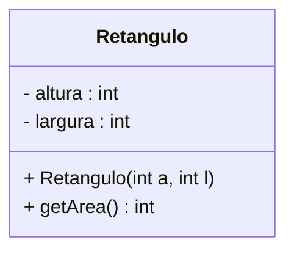
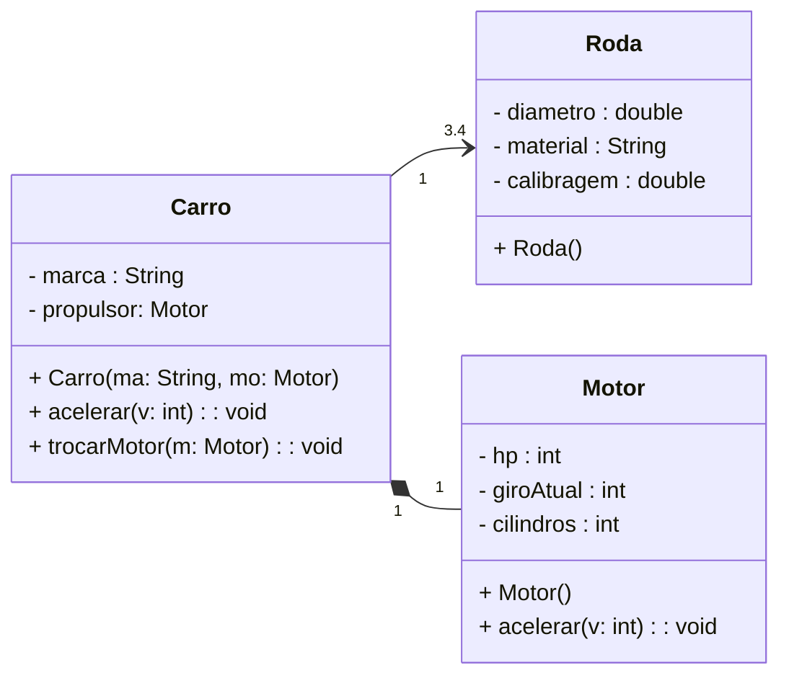
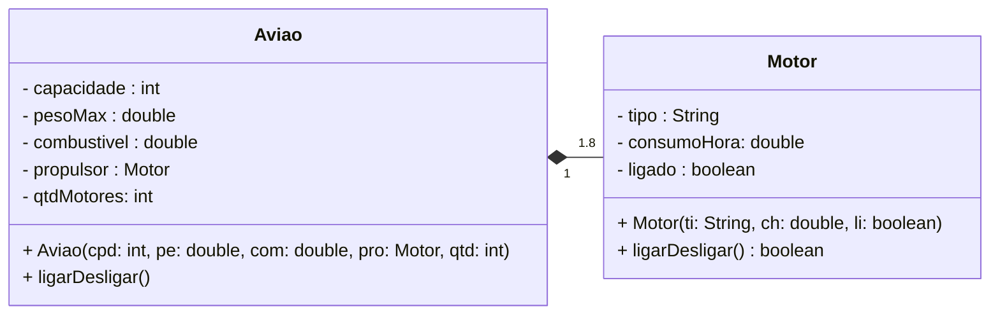

# Teste MERMAID

> Teste diagrama UML com mermaid

```mermaid
classDiagram

    class Retangulo{
        - altura : int
        - largura : int
        + Retangulo(int a, int l)
        + getArea() int
    }
```

```mermaid
classDiagram
    direction LR

    class Roda{
    - diametro : double
    - material : String
    - calibragem : double
    + Roda()
    }

    class Carro{
    - marca : String
    - propulsor: Motor
    + Carro(ma: String, mo: Motor)
    + acelerar(v: int): void
    + trocarMotor(m: Motor): void
    } 

    class Motor{
    - hp : int
    - giroAtual : int
    - cilindros : int
    + Motor()
    + acelerar(v: int): void
    }

    Carro"1" --> "3.4"Roda
    Carro"1" *-- "1"Motor

```

```mermaid
classDiagram
    direction LR

    class Aviao{
        - capacidade : int
        - pesoMax : double
        - combustivel : double
        - propulsor : Motor
        - qtdMotores: int
        + Aviao(cpd: int, pe: double, com: double, pro: Motor, qtd: int)
        + ligarDesligar()
    }

    class Motor{
        - tipo : String
        - consumoHora: double 
        - ligado : boolean
        + Motor(ti: String, ch: double, li: boolean)
        + ligarDesligar() boolean
    }

    Aviao"1" *-- "1.8"Motor
```