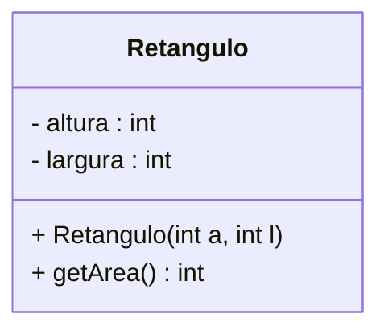
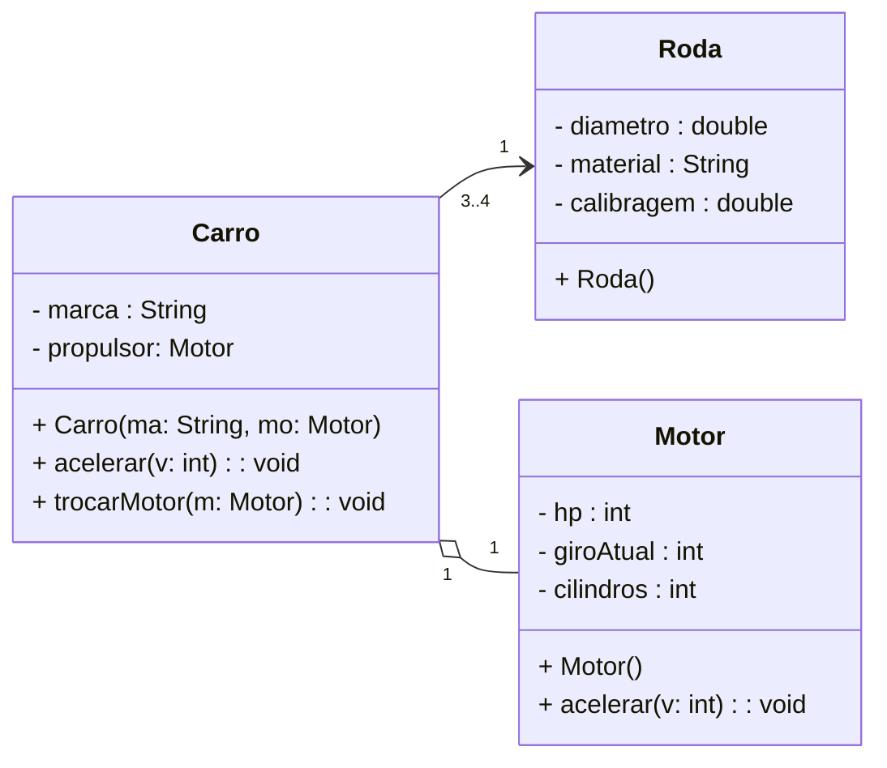

# Teste MERMAID

> Teste diagrama UML com mermaid





```mermaid
classDiagram
    direction LR

    class Aviao{
        - capacidade : int
        - pesoMax : double
        - combustivel : double
        - propulsor : Motor
        + Aviao(ca: int, pe: double, com: double, ??)
    }

    class Motor{
        tipo : String
        ligado : boolean
        + Motor(ti: String, li: boolean)
    }

    Aviao o-- Motor
