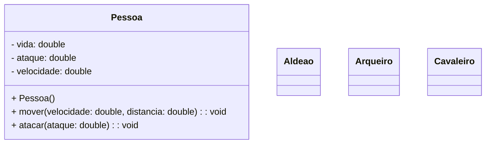

```mermaid

classDiagram
    
    class Pessoa {
        - vida: double
        - ataque: double
        - velocidade: double
        + Pessoa()
        + mover(velocidade: double, distancia: double): void
        + atacar(ataque: double): void
    }
    
    class Aldeao {
    }
    
    class Arqueiro {
    }
    
    class Cavaleiro {
    }
    
```