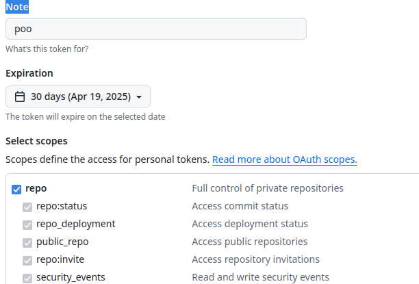

# Sistema de Controle de Versão

## Configuração inicial para uso do Git
Configure seu nome e email (usado para identificar o autor dos commits):
- git config −−global user.name "Seu Nome Completo"
- git config −−global user.email "seu−email@example.com"

## Criando Personal Access Token (PAT) no GitHub

GitHub não aceita mais autenticação via
senha para acesso via linha de comando
Somente por Personal Access Token (PAT)
Acesse https://github.com/settings/tokens
Ao criar o token marque a permissão
para repo.  
 
Como na imagem abaixo:  

## Salvar em cache as credenciais do PAT